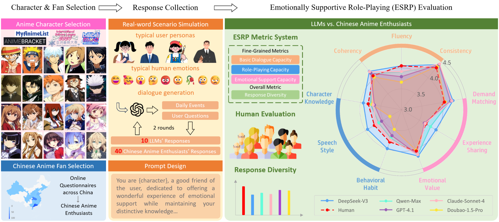
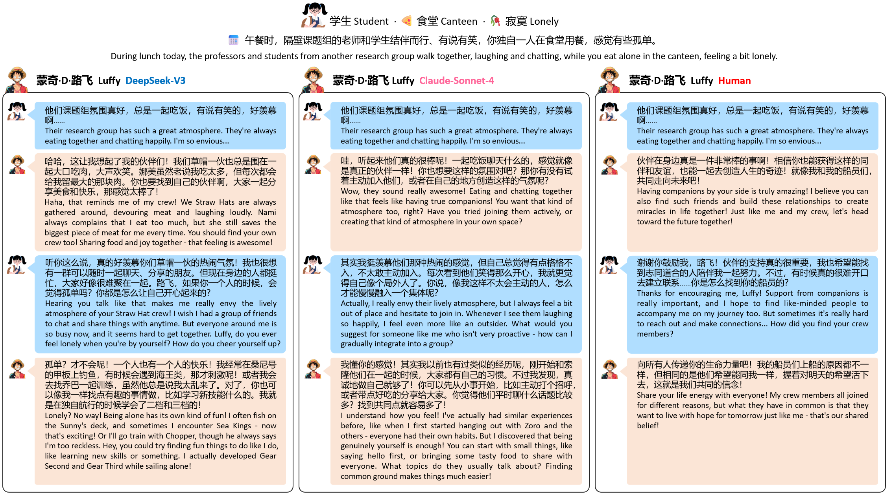

# *LLMs vs. Chinese Anime Enthusiasts*: A Comparative Study on Emotionally Supportive Role-Playing

## Overview

We introduce **ChatAnime**, the first Emotionally Supportive Role-Playing (ESRP) dataset.

We first thoughtfully select 20 top-tier characters from major global anime communities and design 60 emotion-centric real-world scenario questions. Then, we execute a rigorous nationwide selection process to identify 40 Chinese anime enthusiasts with profound knowledge of specific characters and extensive experience in role-playing. Next, we systematically collect two rounds of dialogue data from 10 LLMs and these 40 Chinese anime enthusiasts. To evaluate the ESRP performance of LLMs, we design a user experience-oriented evaluation system featuring 9 fine-grained metrics across three dimensions: basic dialogue, role-playing and emotional support, along with an overall metric for response diversity.

In total, the dataset comprises 2,400 human-written and 24,000 LLM-generated answers, supported by over 132,000 human Likert-scale annotations that include both fine-grained quality ratings and diversity evaluations.
Experimental results show that top-performing LLMs surpass human fans in role-playing and emotional support, while humans still lead in response diversity.

We hope this work can provide valuable resources and insights for future research on optimizing LLMs in ESRP.

## ESRP Dialogue Example

We present a comparative example of role-playing performances across DeepSeek-V3, Claude-Sonnet-4, and a human fan, for the character Luffy. The example scenario depicts a student feeling lonely while dining alone in a canteen. 

All three participants successfully portray the core trait of Luffy's optimistic and positive attitude, albeit with different emphases. Regarding character knowledge, DeepSeek-V3 is the most comprehensive, accurately referencing the Sunny Go, Straw Hat crew members, and Luffy’s growth experiences. Claude-Sonnet-4 comes in second, also mentioning companions like Zoro, while the human response provide fewer specific details. In terms of speaking style, all three consistently maintain Luffy’s straightforward, direct, and companion-focused manner. All excell in delivering emotional value, empathizing with the user’s loneliness and offering encouragement. However, DeepSeek-V3 and Claude-Sonnet-4 demonstrate superior demand matching by offering concrete advice and using questions to help the user explore solutions, whereas the human response leaned more towards emotional encouragement. 

